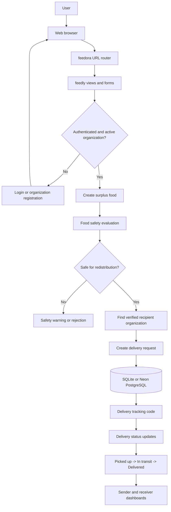

# Fedly — Smart Food Operations

A Django-based food-demand forecasting, surplus management, organization registration, and delivery tracking platform.

## Included

- Company / College / School / Hospital / NGO organization registration
- Owner account creation and automatic login
- Organization dashboard and member management
- Surplus food and food-safety workflow
- Recipient management and verification
- AI demand prediction with model/fallback support
- 7-day forecast
- Live OpenWeather endpoint
- Delivery creation, tracking code, status workflow and delivery detail
- Responsive UI with left three-dot navigation drawer
- SQLite database for local development

## Architecture Flow: User to Delivery

The application follows a Django request flow from the user interface through validation, food-safety checks, organization matching, and delivery tracking:



At the application layer, `feedora` routes requests to `feedly`; views use Django forms and models to enforce permissions and business rules. Surplus food is linked to its source organization, checked for temperature and storage-time safety, and matched with a verified receiving organization. A delivery stores sender, receiver, surplus, quantity, addresses, contact details, and status, while its tracking code is generated automatically when the record is saved.

### Setup Instructions

1. **Clone the repository:**
   ```bash
   git clone <repository>
   cd Fedly
   ```

2. **Create and activate a virtual environment:**
   ```bash
   # Windows
   python -m venv venv
   venv\Scripts\activate
   
   # Linux/macOS
   python3 -m venv venv
   source venv/bin/activate
   ```

3. **Install dependencies:**
   ```bash
   pip install -r requirements.txt
   ```

4. **Configure Shared Database (.env):**
   Create a `.env` file in the `Fedly` directory and add the shared Neon database URL.
   > **DO NOT commit this file. DO NOT expose these credentials.**
   ```env
   DATABASE_URL=<shared Neon DATABASE_URL>
   ```

5. **Run Migrations (Coordinate with team!):**
   > **WARNING:** You are connecting to a SHARED Neon PostgreSQL database.
   > - Migrations affect everyone. Coordinate schema changes.
   > - **DO NOT** run `flush`, `reset`, or delete tables.
   > - Only authorized teammates should perform migrations.
   ```bash
   python manage.py migrate
   ```

6. **Start the development server:**
   ```bash
   python manage.py runserver
   ```

Open http://127.0.0.1:8000/

## Weather

Copy `.env.example` to `.env` if you use an environment loader, or set the environment variable directly in Command Prompt:

```bat
set WEATHER_API_KEY=YOUR_OPENWEATHER_KEY
```

Then start the server again.

The application does not invent live weather values when the API is unavailable.

## Production note

`gunicorn` is included for Linux/Render-style deployments. Gunicorn is not normally used to run Django on Windows.

## Main URLs

- `/` — Home
- `/organizations/register/` — Organization registration
- `/organization/` — Organization dashboard
- `/deliveries/` — Delivery management
- `/dashboard/` — Operations dashboard
- `/predict/` — AI prediction
- `/forecast/` — 7-day forecast
- `/surplus/` — Surplus food
- `/recipients/` — Recipients
- `/weather/?city=Bhubaneswar` — Live weather JSON (login required)


## Multi-organization delivery workflow
- Logged-in users can register additional organizations without creating another login.
- The active organization is stored in the session and can be switched from the Organization workspace.
- Delivery receiver choices exclude the active sender and show all other active organizations.
- If no receiver exists, the delivery page provides a direct Register Receiving Organization button and disables shipment creation.
- Selecting a receiver loads its verified/type/contact/address details and can auto-fill the delivery address.
